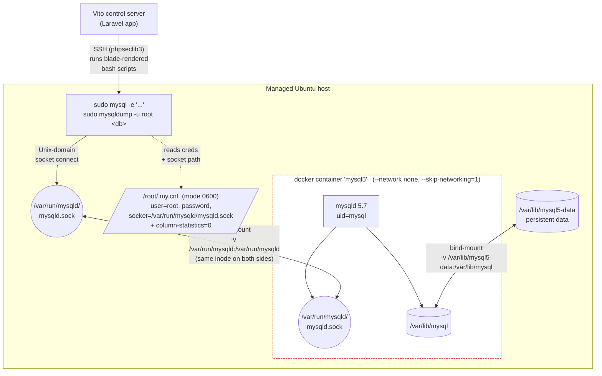
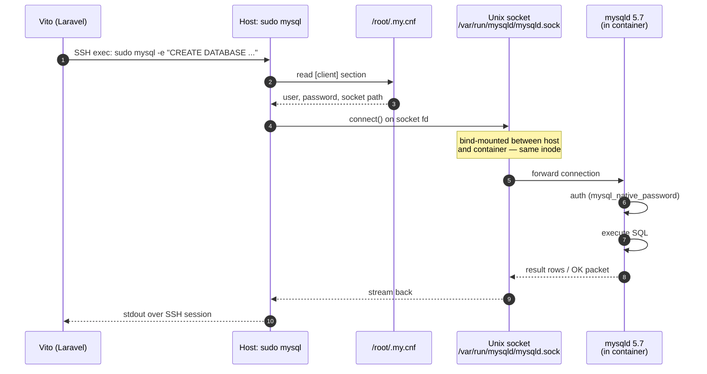

# Vito Deploy — MySQL 5 Plugin

Adds support for installing legacy MySQL 5.x versions in Vito Deploy by running them as a Docker container — sidestepping the EOL packaging problems on modern Ubuntu.

## Supported versions

- **MySQL 5.7** — runs the official `mysql:5.7` Docker image

> MySQL 5.7 reached end-of-life in October 2023 and no longer receives security updates from Oracle. Use only for legacy applications that cannot be upgraded.

## What it does

- Registers a new database service named **MySQL 5** (id: `mysql5`)
- Installs Docker (from Docker's official apt repo) if not already present
- Installs the host-side `mysql` / `mysqldump` binaries via `mysql-client-core-8.0` if no `mysql` binary is already in PATH (the 8.0 client is wire-protocol-compatible with a 5.7 server)
- Pulls and runs `mysql:5.7` with **no exposed TCP port**: the container has `--network none` and `--skip-networking=1`, and the daemon's Unix socket is bind-mounted to `/var/run/mysqld/mysqld.sock` on the host
- Writes `/root/.my.cnf` (mode 0600) so `sudo mysql` and `sudo mysqldump -u root` work on the host with no flags — this is what every Vito core database view shells out to
- Registers a `mysql.service` systemd unit that wraps `docker start`/`docker stop` so `systemctl status mysql` reports the service active and Vito's install validation passes
- Reuses Vito's core MySQL scripts for create / delete / user / link / unlink / backup / restore operations (SQL syntax is identical between 5.7 and 8.x for these)

## Database management

Once installed, the standard Vito **Database** tab manages this service exactly like a native MySQL/MariaDB/PostgreSQL install. You can create databases, create/update/delete users, link users to databases with permissions, run backups, restore from backups, and list databases/users — all through the same UI.

## Compatibility

- **Any Ubuntu where Docker runs** (jammy / noble / etc.). The libssl1.1 codename-remap dance the previous native install needed is gone.
- The container ships amd64 and arm64v8 manifests, so both architectures work.

## How communication works (Unix socket, no TCP)

The container has **no TCP port** of any kind. Everything talks to mysqld through a single Unix socket file that is shared between host and container via a Docker bind-mount.

### Architecture

### Call flow for a single Vito operation

What that means in practice:

1. Vito SSHes into the managed host and runs `sudo mysql -e "<sql>"` (or `sudo mysqldump`). This is exactly what every Vito core database blade view does — none of them are aware the server is in a container.
2. The mysql client process runs **on the host**, as root via sudo. It reads `/root/.my.cnf`, picks up the username, password, and `socket=` path.
3. It opens a Unix-domain socket connection to `/var/run/mysqld/mysqld.sock` on the host filesystem.
4. That socket file was created by **mysqld inside the container** because we bind-mounted the host directory `/var/run/mysqld` into the container at the same path. Both sides see the same inode; the kernel routes the connection across the namespace boundary.
5. mysqld authenticates with `mysql_native_password` against the credentials baked into the data dir.
6. Results stream back over the same socket → mysql client on the host → SSH session → Vito.

### Connecting application code

Apps on the same host must connect via the socket too:

- **Laravel / PHP**: set `DB_HOST=localhost` and either `DB_SOCKET=/var/run/mysqld/mysqld.sock` or rely on the mysql client's "host=localhost ⇒ socket" convention.
- **`DB_HOST=127.0.0.1` will not work** — there is no listener on TCP 3306.

### If you need TCP access anyway

Edit `install-57.blade.php`: drop `--network none` and `--skip-networking=1`, then add `-p 127.0.0.1:3306:3306` to the `docker run` command. The default deliberately rules out any network surface, but the socket-based UI integration keeps working unchanged either way.

## Security notes

- The root password is generated at install time, persisted to `/root/.mysql5_root_pw` (mode 0600), and written to `/root/.my.cnf` (mode 0600). Same pattern Debian's stock MySQL packages use via `/etc/mysql/debian.cnf`.
- Re-running install reuses the existing password file so the container's stored credentials and `/root/.my.cnf` stay in sync.
- The container runs with `MYSQL_ROOT_HOST=localhost` (defense in depth on top of `--skip-networking`).

## Installation

Drop this directory into `storage/plugins/` and enable it via the Vito plugin manager.

## Uninstall

Removes the systemd unit, container, image, data dir (`/var/lib/mysql5-data`), socket dir (`/var/run/mysqld`), and the credential files. Deliberately does **not** uninstall Docker or the mysql client package, since other plugins or services on the host may depend on them.

## Notes

- Only one database service can be installed per server — uninstall any existing MySQL/MariaDB/PostgreSQL service first.
- The systemd unit name (`mysql`) is the same as core MySQL 8.x, so the two cannot coexist on the same server.
- Persistent data lives at `/var/lib/mysql5-data` on the host (separate from `/var/lib/mysql` to avoid colliding with a future native install).
